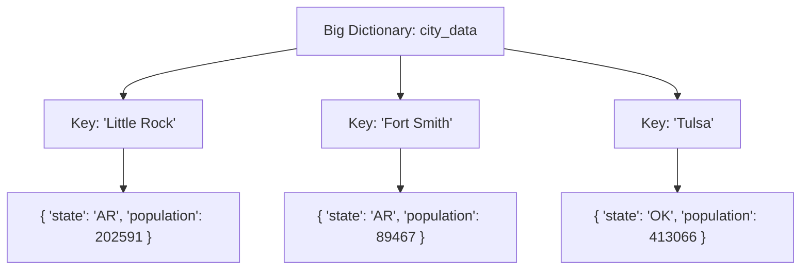
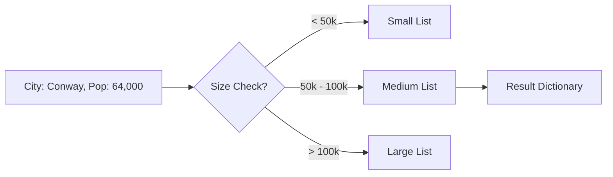

# Intermediate Python Exercises: Logic Illustration

## Challenge 1: The "State Analyzer" (Nested Data)

### 🎯 Goal
We need to dig into a complex dataset (a dictionary inside a dictionary!) to find specific information about a single state.

### 🧩 The Data Structure
Imagine a filing cabinet where each folder is a City. Inside each folder, there are papers with details like 'state' and 'population'.



### 🧠 Logic Flow
We want to answer: *"How many cities are in Arkansas (AR), and what is their average size?"*

1.  **Start w/ Zeros**: `count = 0`, `total_pop = 0`.
2.  **Loop** through every city folder.
3.  **Check**: Is the state 'AR'?
    *   *No*: Ignore it.
    *   *Yes*:
        *   Add 1 to `count`.
        *   Add this city's population to `total_pop`.
4.  **Finish**: Divide `total_pop` by `count` to get the average.

---

## Challenge 2: The "Population Grouper" (Categorization)

### 🎯 Goal
We have a messy list of cities and their sizes. We want to organize them into three clear "buckets" or groups: Small, Medium, and Large.

### 🧩 The Transformation
We are turning a flat list of items into grouped categories.

**Input (Messy Pile):**
*   Conway (64k)
*   Little Rock (202k)
*   Vilonia (4k)
*   Dallas (1.3M)

**The Sorter (Your Logic):**
*   **Small Bucket**: $< 50,000$
*   **Medium Bucket**: $50,000 - 100,000$
*   **Large Bucket**: $> 100,000$

### 🧠 Logic Flow



**Final Output Structure:**
A dictionary where the *Keys* are the category names, and the *Values* are lists of cities.
```python
{
    'Small':  ['Vilonia', ...],
    'Medium': ['Conway', ...],
    'Large':  ['Little Rock', 'Dallas', ...]
}
```
